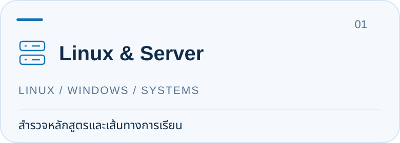
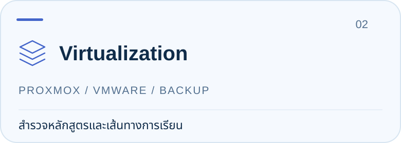
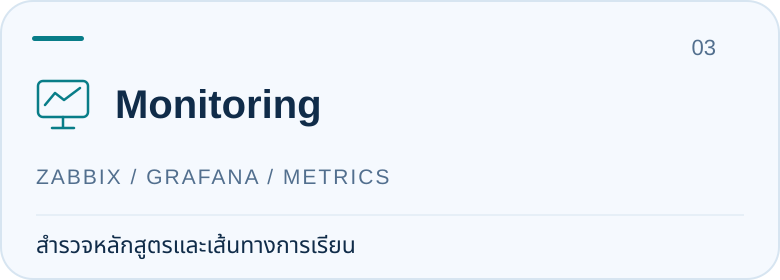
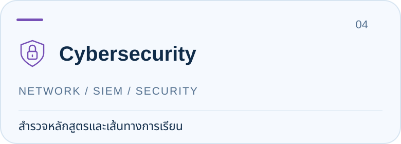
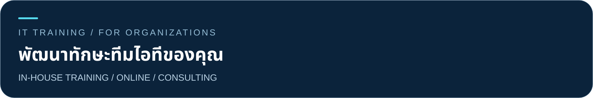

<!-- Profile owned by ittraining2498. Original content: docs/previous-profile.md. Native Follow is controlled by GitHub; the Shields count is cached. -->

<strong>จากพื้นฐานสู่การลงมือทำ สำหรับผู้ดูแลระบบและทีมไอที</strong> Linux · Virtualization · Monitoring · Cybersecurity · DevOps

 &nbsp; <strong>เรียนรู้ไม่มีวันสิ้นสุด</strong> ติดตามบทเรียนด้วยปุ่ม Follow บนโปรไฟล์ · ตัวเลขในป้ายอาจมีเวลาหน่วง

## เส้นทางการเรียนที่เหมาะกับคุณ

**เพิ่งเริ่มต้น?** เริ่มที่ Linux & Server &nbsp; · &nbsp; **ดูแลระบบอยู่แล้ว?** ต่อยอด Virtualization, Monitoring และ Security

<a href="docs/course-catalog.md#systems"><picture><source media="(prefers-color-scheme: dark)" srcset="assets/profile/linux-dark.svg"></picture></a>
<a href="docs/course-catalog.md#virtualization"><picture><source media="(prefers-color-scheme: dark)" srcset="assets/profile/virtualization-dark.svg"></picture></a>
<a href="docs/course-catalog.md#monitoring"><picture><source media="(prefers-color-scheme: dark)" srcset="assets/profile/monitoring-dark.svg"></picture></a>
<a href="docs/course-catalog.md#security"><picture><source media="(prefers-color-scheme: dark)" srcset="assets/profile/security-dark.svg"></picture></a>

- **Linux & Server** — ฝึกใช้คำสั่ง จัดการผู้ใช้และบริการ ก่อนต่อยอดงานดูแลเซิร์ฟเวอร์
- **Virtualization** — ทำความเข้าใจเครื่องเสมือน ทรัพยากร และการจัดการระบบ
- **Monitoring** — เริ่มติดตั้งเครื่องมือ แล้วเรียนรู้การติดตามสถานะของระบบ
- **Cybersecurity** — ต่อจากพื้นฐานเครือข่าย สู่การตรวจสอบและวิเคราะห์เหตุการณ์

## ทดลองเรียนจากบทเรียนจริง

เลือกดูเนื้อหาการสอนก่อนตัดสินใจเรียนต่อ ทุกบทเรียนด้านล่างเปิดดูได้ฟรีบน YouTube

### 01 · ปูพื้นฐานกับ Proxmox

**สำหรับ:** ผู้เริ่มต้นด้าน Virtualization 
**จุดเริ่มต้น:** ทำความรู้จัก Proxmox ผ่านบทเรียน EP1 ก่อนต่อยอดการทดลองในแล็บ

[**เปิดบทเรียน Proxmox**](https://youtu.be/Co-YU5pwqBM)

### 02 · ติดตั้ง Zabbix ทีละขั้นตอน

**สำหรับ:** ผู้ดูแลระบบที่ต้องการเริ่มใช้ Monitoring 
**สิ่งที่ได้ฝึก:** ทำตามขั้นตอนติดตั้งและกำหนดค่า Zabbix ในสภาพแวดล้อมทดลอง

[**เปิดบทเรียน Zabbix**](https://youtu.be/ywPXwkfWoyI)

<strong>ดูบทเรียนเพิ่มเติม · Server, VMware และ Network Security</strong>

- [พื้นฐานเซิร์ฟเวอร์ — เคล็ดไม่ลับ อยากทำเซิร์ฟเวอร์](https://youtu.be/53hBLvspjWw)
- [เพิ่มเครื่อง ESXi เข้า vCenter](https://youtu.be/wMbPKTS6bUc)
- [ติดตั้ง vCenter ถึง Stage 2](https://www.youtube.com/watch?v=3vgzxvHA1vM)
- [เปลี่ยนรหัสผ่าน root บน iDRAC](https://www.youtube.com/watch?v=8icfId9I4T4)
- [ติดตั้ง VMware ESXi 8.x ทีละขั้นตอน](https://www.youtube.com/watch?v=jZxXSPdiUp4)
- [เริ่มต้นใช้ Nmap บน Windows](https://www.youtube.com/watch?v=puHX5KehvwQ)

[ดูวิดีโอทั้งหมด](https://youtube.com/@ittraining2498) &nbsp; · &nbsp; [เอกสารและแหล่งดาวน์โหลด](docs/resources.md)

## เรียนกับ IT Training

ศูนย์อบรมไอทีเทรนนิ่งเปิดให้บริการตั้งแต่ **เมษายน 2562** ถ่ายทอดความรู้ด้าน System Engineering, Cybersecurity และ DevOps จากประสบการณ์ทำงานจริง

**ลงมือทำในแล็บ** — เรียนรู้ผ่านขั้นตอนและสถานการณ์ที่เชื่อมโยงกับงานดูแลระบบ 
**มีเอกสารทบทวน** — Student Workbook และ Lab Guide ตามรายละเอียดของหลักสูตร 
**เลือกรูปแบบที่เหมาะกับคุณ** — อบรมในองค์กร เรียนสดออนไลน์ หรือเรียนผ่านวิดีโอ

[ประวัติผู้สอน ประสบการณ์ และบริการของเรา](docs/about.md)

พูดคุยเรื่องพื้นฐานของทีม หัวข้อที่ต้องใช้ และรูปแบบการอบรมที่เหมาะกับองค์กร

[**ปรึกษาการอบรมผ่าน LINE @linux**](https://lin.ee/n5o31g8) &nbsp; · &nbsp; [ขอข้อมูลทางอีเมล](mailto:sales@ittraining.co.th)

## เรียนรู้ต่อไปด้วยกัน

[**GitHub · เอกสารและหลักสูตร**](https://github.com/ittraining2498/CourseOutline) &nbsp; / &nbsp; [**YouTube · บทเรียนฟรี**](https://youtube.com/@ittraining2498) &nbsp; / &nbsp; [**กลุ่มผู้เรียน · แลกเปลี่ยนความรู้**](docs/community.md)

---

<strong>IT TRAINING · เรียนรู้ไม่มีวันสิ้นสุด</strong> 
<a href="https://www.ittraining.co.th">เว็บไซต์</a> &nbsp; · &nbsp; <a href="https://www.facebook.com/linuxsplunkproxmox">Facebook</a> &nbsp; · &nbsp; <a href="https://lin.ee/n5o31g8">LINE @linux</a> 
<a href="mailto:sales@ittraining.co.th">sales@ittraining.co.th</a> &nbsp; · &nbsp; 082-789-4621

