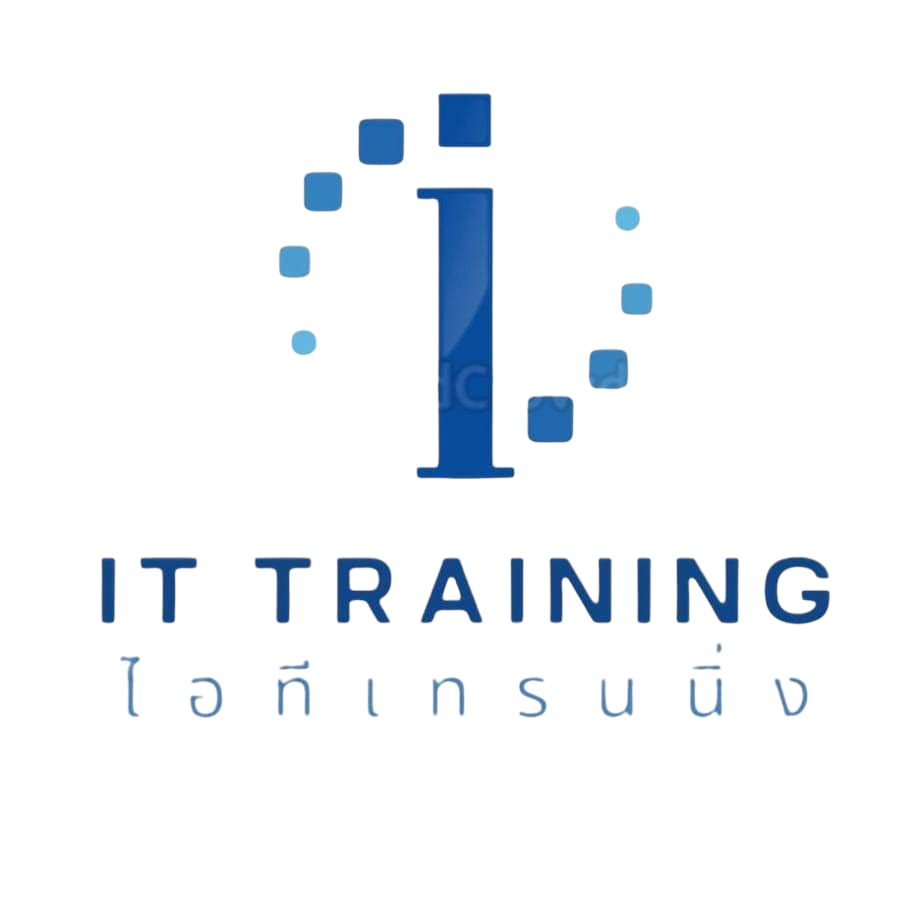
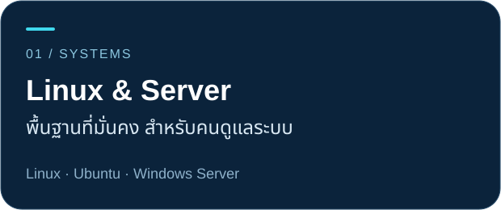
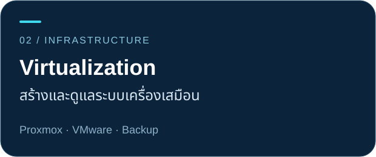
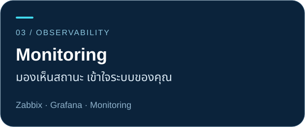
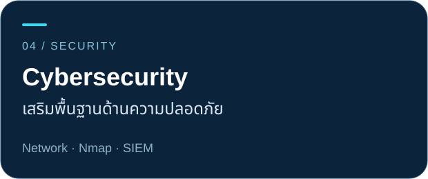
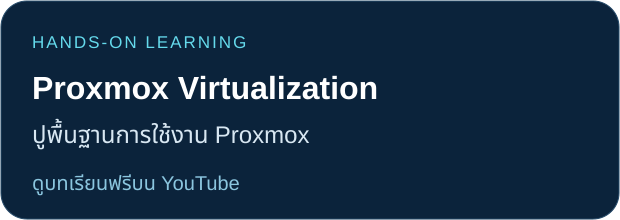
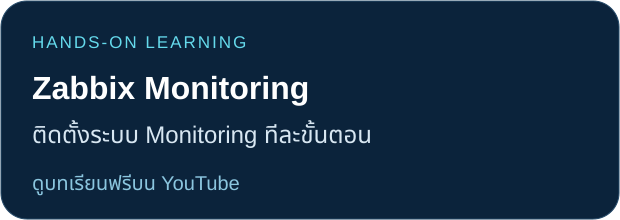

<!-- IT Training profile. Assets are local to this repository. The native GitHub Follow control remains unchanged. Follower badge is cached by Shields/GitHub and is not instantaneous. Full previous content is preserved in docs/previous-profile.md. -->

  

  <strong>IT TRAINING</strong> &nbsp; · &nbsp; เรียนรู้ไม่มีวันสิ้นสุด 
  SERVER &nbsp; / &nbsp; CLOUD &nbsp; / &nbsp; SECURITY &nbsp; / &nbsp; DEVOPS

  เรียนรู้จากประสบการณ์จริง ผ่านบทเรียนและแล็บที่พาคุณลงมือทำ 
  <strong>สำหรับผู้เริ่มต้น ผู้ดูแลระบบ และทีมไอทีในองค์กร</strong>

  
  
  

  
  &nbsp; <a href="https://github.com/ittraining2498"><strong>@ittraining2498</strong></a>
   ติดตามได้ด้วยปุ่ม Follow บนหน้าโปรไฟล์นี้ · จำนวนในป้ายอาจอัปเดตช้ากว่าจำนวนที่ GitHub แสดง

## เลือกเส้นทางการเรียน

เริ่มจากเรื่องที่คุณสนใจ แล้วต่อยอดสู่ระบบที่คุณดูแล

  
  

  
  

  <a href="docs/course-catalog.md"><strong>สำรวจหลักสูตรทั้งหมด</strong></a> &nbsp; · &nbsp;
  <a href="https://github.com/ittraining2498/CourseOutline">อ่าน Course Outline</a>

## ลงมือทำผ่านบทเรียนจริง

  
  

<strong>ดูบทเรียนเพิ่มเติม — Server, VMware และ Network Security</strong>

- [พื้นฐานเซิร์ฟเวอร์ — เคล็ดไม่ลับ อยากทำเซิร์ฟเวอร์](https://youtu.be/53hBLvspjWw)
- [เพิ่มเครื่อง ESXi เข้า vCenter](https://youtu.be/wMbPKTS6bUc)
- [ติดตั้ง vCenter ถึง Stage 2](https://www.youtube.com/watch?v=3vgzxvHA1vM)
- [เปลี่ยนรหัสผ่าน root บน iDRAC](https://www.youtube.com/watch?v=8icfId9I4T4)
- [ติดตั้ง VMware ESXi 8.x ทีละขั้นตอน](https://www.youtube.com/watch?v=jZxXSPdiUp4)
- [เริ่มต้นใช้ Nmap บน Windows](https://www.youtube.com/watch?v=puHX5KehvwQ)

[ดูวิดีโอทั้งหมดในช่อง IT Training](https://youtube.com/@ittraining2498) · [เอกสารและแหล่งดาวน์โหลด](docs/resources.md)

## พัฒนาทักษะทีมไอทีของคุณ

ศูนย์อบรมไอทีเทรนนิ่ง เปิดให้บริการตั้งแต่ **เมษายน 2562** เน้นการเรียนรู้ด้าน System Engineering, Cybersecurity และ DevOps ผ่านการลงมือทำ

**อบรมในองค์กร · เรียนสดออนไลน์ · เรียนผ่านวิดีโอ**

พูดคุยเรื่องพื้นฐานของทีม หัวข้อที่ต้องใช้ และรูปแบบการอบรมที่เหมาะกับองค์กรของคุณ

[**ปรึกษาการอบรมผ่าน LINE @linux**](https://lin.ee/n5o31g8) &nbsp; · &nbsp; [ประวัติและบริการของเรา](docs/about.md)

---

  <strong>IT TRAINING · ศูนย์อบรมไอทีเทรนนิ่ง</strong> 
  <a href="https://www.ittraining.co.th">เว็บไซต์</a> &nbsp; · &nbsp;
  <a href="https://www.facebook.com/linuxsplunkproxmox">Facebook</a> &nbsp; · &nbsp;
  <a href="https://youtube.com/@ittraining2498">YouTube</a> &nbsp; · &nbsp;
  <a href="docs/community.md">ช่องทางติดตามและกลุ่มผู้เรียน</a> 
  <a href="mailto:sales@ittraining.co.th">sales@ittraining.co.th</a> &nbsp; · &nbsp; 082-789-4621

